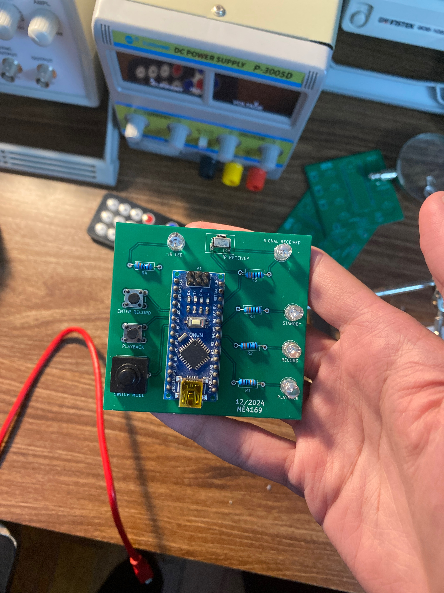

# Universal Remote Control
A universal remote control based on the AVR ATmega328P, capable of recording and replaying IR signals from other remotes, enabling an all-in-one solution for controlling multiple electronic devices.

## Project Structure
- `hardware/` - MCU hardware drivers, where related registers (e.g., EEPROM, GPIO) are grouped into structs for cleaner, more readable access.
- `src/` - Application logic implementing signal capture, processing, and playback.

## Signal Capture & Playback
- IR signal capture are carried out using Timer1's Input Capture. Alternating between Rising and Falling edge setting for Input Capture interrupt, I can accurately measure the pulse widths of signal and store them in an array. Overflow interrupt of Timer1 indicated that the signal capture has been completed.
- For persistent storage, the array in then stored in EEPROM.
- Signal playback is carried out using Timer1 and Timer0. Timer1's Compare Match mode is used to match the pulse widths stored in array. Timer0's Fast PWM mode is used for signal modulation (at 38kHZ) during the duration as dictated by Timer1.

## Build & Flash
**Toolchain installation (Ubuntu):**
```
sudo apt-get install avrdude binutils-avr avr-libc gcc-avr
```

**Compile:**
```
make all
```

**Flash to MCU:**
```
make flash
```

## Result


